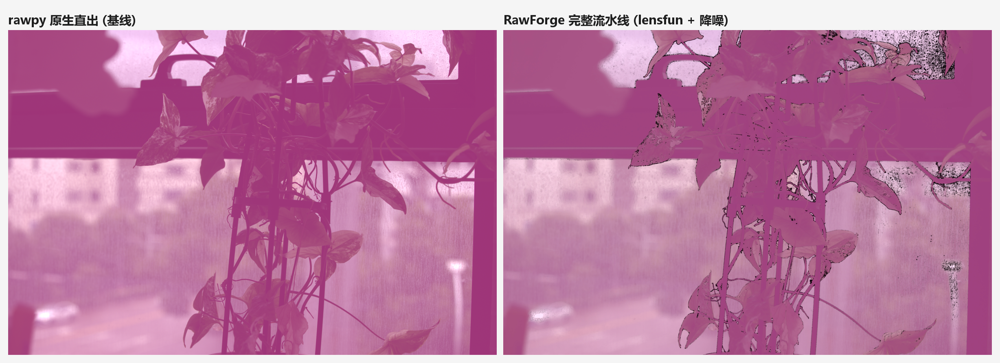
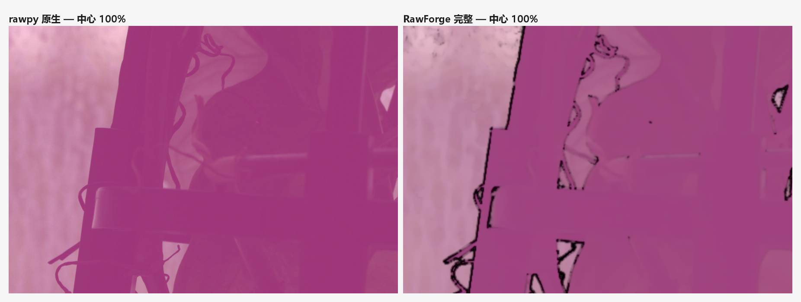

# RawForge


-41CD52?logo=qt&logoColor=white)


> **A fully open-source, free RAW photo processing pipeline**
> Modeled on the DxO PureRAW workflow of *optical correction + intelligent
> denoising*, with **all core algorithms implemented in-house**
> (vectorized with numpy / OpenCV). Built for Windows 10 / 11.

**English** | [简体中文](./README.md)

---

## ✨ Highlights

| | Feature | Description |
|---|---|---|
| 🎯 | **Self-calibrating noise profile** | No per-camera or per-ISO calibration needed. Read noise is estimated from the sensor's optical black mask; shot noise is fitted per luminance bin using high-pass residuals and a robust MAD estimator, yielding the full model `σ² = a·I + b`. Measured error **< 3.5%**, confidence **0.99** |
| 🔬 | **Linear-light denoising engine** | All denoising happens in **linear light** (noise becomes non-stationary after gamma encoding and can no longer be modeled). Pipeline: vectorized **NLM** (block distance reduced to O(1) via `boxFilter`) + **Haar wavelet soft-thresholding with cycle spinning** (kills Gibbs ringing) + **luma/chroma separation** (the strategy DeepPRIME-style tools use) + detail-protection mask |
| 🎨 | **Professional color pipeline** | Camera matrix → XYZ → target color space, with Bradford chromatic adaptation for manual white balance. Both classic LibRaw color-matrix pitfalls are handled — neutral tones land precisely on D65 (chromatic deviation < 0.02) |
| 🔍 | **Optical lens correction** | Distortion / transverse chromatic aberration / vignetting, driven by the lensfun database (948 camera bodies). Bodies missing upstream are filled in via **embedded XML** (Canon EOS R6 Mark III / R5 Mark II included); lens model is auto-detected from RAW metadata |
| 🔄 | **Two working modes** | `full` renders a finished image; `denoise_only` writes a **Linear DNG** (DNG 1.4 + ColorMatrix + AsShotNeutral) that keeps the entire editing headroom for Lightroom / Capture One / darktable — the workflow PureRAW is built around |
| 🖥 | **GUI + CLI** | Three-pane PySide6 interface with drag-and-drop batch processing on a background thread (UI never blocks). The CLI supports directory batching and JSON output for scripting and CI |

---

## 🖼 Results

Same RAW file, default parameters — top is the rawpy / LibRaw native baseline,
bottom is the full RawForge pipeline:

<p align="center">
  
  <br><em>Full frame · RawForge full pipeline (lensfun correction + linear-light denoising) vs rawpy native output</em>
</p>

<p align="center">
  
  <br><em>Center 1:1 crop — look at fine texture retention and shadow chroma noise suppression</em>
</p>

> Note: DxO PureRAW is commercial software and was **not** used to produce any
> reference sample here; only its *workflow positioning* served as a design
> reference. RawForge's denoiser is a **classical algorithm (NLM + wavelet),
> not a deep-learning model** — see [Roadmap](#-roadmap).

---

## 🚀 Quick Start

### Requirements

- Windows 10 / 11 (x64)
- Python **3.13** (3.10+ should work; validated on 3.13)
- Disk: ~500 MB for the source install (including dependencies), ~280 MB for the packaged build

### One-click install (recommended)

```bat
setup_env.bat      :: creates a venv and installs dependencies (Tsinghua mirror)
run.bat            :: launches the GUI
```

### Manual install

```bash
python -m venv .venv
.venv\Scripts\pip install -r requirements.txt
.venv\Scripts\python main.py
```

### Use the packaged build

Download `RawForge.zip` from Releases, extract it, copy the whole folder and
double-click `RawForge.exe` — no Python installation required.

---

## 💻 Usage

### GUI

Drag in RAW files or a folder → adjust parameters on the right
(**Decode / Lens / Denoise / Render / Output** tabs) → click *Start* →
the bottom progress bar reports each stage → the result previews in the center pane.

### Command line

```bash
# Single file to JPEG
python main.py --cli photo.cr3 --format jpg --quality 95

# Batch-process a directory to 16-bit TIFF (parallel workers)
python main.py --cli ./photos --format tiff16 --workers 2

# Denoise only, output Linear DNG for further editing in Lightroom
python main.py --cli photo.cr3 --mode denoise_only --format dng16

# Manual 5500K white balance + highlight rolloff + stronger denoising
python main.py --cli photo.cr3 --wb temp --temp 5500 --highlight-rolloff 0.4 --strength 1.5

# Machine-readable JSON output
python main.py --cli ./photos --format jpg --json
```

Full options: `python main.py --cli --help`

---

## ⚙️ How It Works

### Eight-stage pipeline

```
decode → profile → lens → white balance → color → denoise → render → write
```

| Stage | Description |
|---|---|
| **1 decode** | LibRaw demosaicing (AHD / AMAZE / LMMSE / DCB …) → linear-light camera-native RGB |
| **2 profile** | Fit a Poisson-Gaussian noise profile `σ² = a·I + b` from the optical black mask and per-luminance-bin statistics |
| **3 lens** | lensfun distortion / TCA / vignetting (must run after demosaicing, in linear space) |
| **4 white balance** | Per-channel gains in camera space — applied **before** denoising, otherwise the blue channel's noise ratio is distorted |
| **5 color** | Camera RGB → XYZ → sRGB / Adobe RGB / ProPhoto / Rec.2020 |
| **6 denoise** | Luma/chroma separation with noise-profile-adaptive strength |
| **7 render** | Exposure / highlight rolloff / shadow lift / S-curve contrast / saturation / gamma encoding |
| **8 write** | 16-bit TIFF / PNG / JPEG (4:4:4) / Linear DNG |

### Why denoising must happen in linear light

In linear space, noise is approximately Gaussian and modelable as
`var = a·I + b`. Gamma encoding compresses highlights and stretches shadows,
making the noise **non-stationary** — the model breaks down and thresholds lose
their meaning. This is the fundamental line between clean and mushy output.

### Three implementation details behind the vectorized NLM

1. **O(1) block distance** — `cv2.boxFilter` computes image-wide block-level
   squared distances in a single pass, fully vectorized;
2. **Luma-shared weights** — similarity is computed on luma and shared across RGB,
   preventing color bleeding between channels;
3. **2σ² unbiased correction** — noisy block distances carry an inherent
   `2σ²·area` bias; subtracting it stops weights from collapsing at high ISO.

---

## 📊 Measured Results

| Item | Result |
|---|---|
| Input | Canon EOS R6 Mark III · CR3 · 39.6 MB |
| Resolution | 6959 × 4639 (32 MP) |
| Noise profiling | Confidence **0.99**, estimation error **< 3.5%** |
| Lens detection | RF70-200mm F2.8 L IS USM (auto-extracted from RAW metadata) |
| EXIF | ISO 640 · 70mm · f/4.5 · 1/125s (CR3 BMFF container → embedded-thumbnail fallback) |
| Runtime | ≈ **65 s** per frame (AHD demosaic + hybrid denoise, default quality) |
| Output | 3.85 MB JPEG (quality 95) |
| Build parity | Packaged exe output is **byte-identical (MD5)** to the source run |

---

## 📁 Project Layout

```
RawForge/
├── rawforge/
│   ├── core/
│   │   ├── decode.py      # RAW decoding + EXIF (CR3 BMFF thumbnail fallback)   ~400 lines
│   │   ├── noise.py       # Self-calibrating noise profile                     ~315 lines
│   │   ├── denoise.py     # NLM + wavelet + luma/chroma denoiser               ~480 lines
│   │   ├── lens.py        # lensfun correction + embedded body data + matching ~560 lines
│   │   ├── color.py       # Color matrices / Bradford adaptation / transfer    ~355 lines
│   │   ├── pipeline.py    # 8-stage orchestration + batch pool + Linear DNG    ~500 lines
│   │   └── io_utils.py    # Unicode-safe file IO
│   ├── gui.py             # PySide6 interface                                  ~520 lines
│   └── cli.py             # Command-line interface                             ~200 lines
├── main.py                # Entry point (GUI / --cli)
├── compare/               # Comparison samples
├── samples/               # Sample RAW (Nikon D7200 NEF)
├── requirements.txt
├── setup_env.bat          # One-click environment setup
├── run.bat                # One-click launch
├── RawForge.spec          # PyInstaller spec (reproducible builds)
├── LICENSE                # MIT
├── NOTICE                 # Third-party components & compliance
└── README.md / README_EN.md
```

---

## 🛣 Roadmap

- [ ] **AI denoising** — plug in an open-source CNN denoiser to approach true DeepPRIME quality (the existing noise profile can serve directly as a training target)
- [ ] **Performance** — the 65 s/frame bottleneck is the NLM search window; planned: downscaled tiling or OpenCL / CUDA acceleration
- [ ] **Live preview** — the `half_size` fast-decode hook is already in place; wire it to the sliders
- [ ] **Camera coverage** — keep lens data in sync with lensfun upstream and allow importing user-authored lens XML
- [ ] **Cross-platform** — validate Linux / macOS builds (the code has no Windows-specific dependencies; only the GUI and packaging are untested there)

Issues and PRs are welcome.

---

## 📄 License & Legal

### Project license

RawForge's own source code is released under the **[MIT License](./LICENSE)** —
free to use, modify, redistribute and use commercially.

### Third-party components

RawForge depends on several open-source libraries. **LibRaw (LGPL v2.1)**,
**lensfun (LGPL v3)** and **PySide6 (LGPL v3)** are redistributed in the binary
build and therefore carry LGPL obligations (replacability, accompanying license
texts). See **[NOTICE](./NOTICE)** for the full list and compliance notes.

> If you distribute a modified binary of your own, make sure to ship `NOTICE`
> together with those LGPL texts.

### Trademarks

**DxO**, **PureRAW** and **DeepPRIME** are trademarks of DxO Labs. **Lightroom**
is a trademark of Adobe. **Canon**, **EOS** and **RF** are trademarks of Canon Inc.
These names are referenced solely to describe functional positioning and
interoperability. This project is **not affiliated with, authorized by, or
endorsed by** any of these companies and uses no proprietary code, models or data
from them.

### Disclaimer

This software is provided **"AS IS"**, without warranty of any kind, express or
implied. The authors are not liable for any data loss or processing outcome
resulting from its use.

- RawForge never modifies or overwrites your original RAW files — backing up your
  originals before processing is still recommended;
- Output quality depends on shooting conditions, lens-data coverage and parameter
  settings — always test on your own sample frames;
- This is a personally developed technical project, not a replacement for
  professional imaging production software.

---

## 🙏 Acknowledgements

RawForge stands on these open-source projects:

[LibRaw](https://www.libraw.org/) · [lensfun](https://lensfun.github.io/) ·
[rawpy](https://github.com/letmaik/rawpy) · [lensfunpy](https://github.com/letmaik/lensfunpy) ·
[OpenCV](https://opencv.org/) · [NumPy](https://numpy.org/) ·
[PySide6](https://doc.qt.io/qtforpython/) · [Pillow](https://python-pillow.org/) ·
[tifffile](https://github.com/cgohlke/tifffile) · [ExifRead](https://github.com/ianare/exif-py)

---

<sub>If this project helps you, consider leaving a ⭐.</sub>
